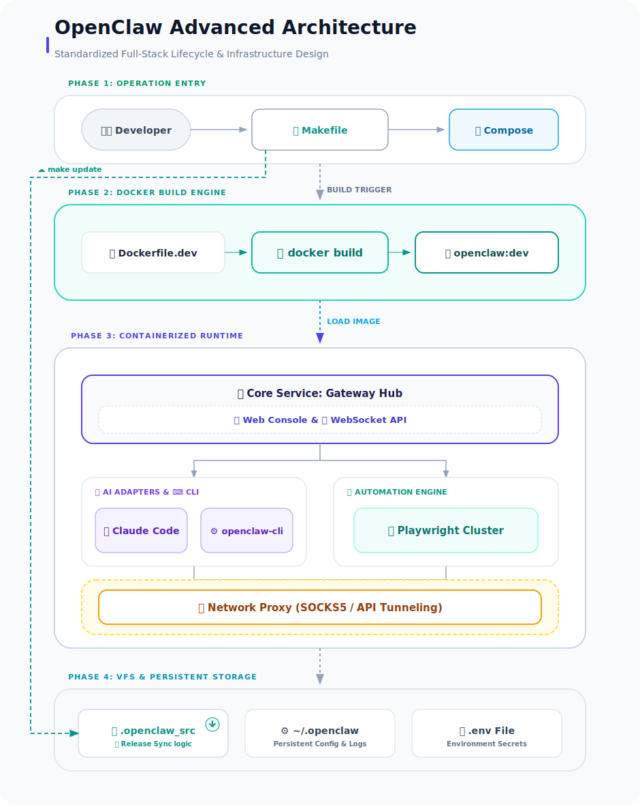
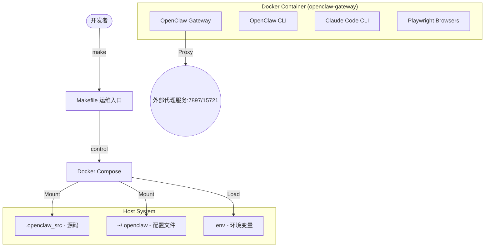

# OpenClaw 开发工具箱套件 (OpenClaw DevKit)

<p align="center">
  <a href="https://github.com/openclaw/openclaw"></a>
  <a href="https://www.docker.com/"></a>
  <a href="https://claude.ai/code"></a>
</p>

**OpenClaw 开发工具箱套件** 为 [OpenClaw](https://github.com/openclaw/openclaw) 多通道 AI 生产力工具提供完整的容器化开发、调试与运行环境。

集成了一套开箱即用的工具链，旨在帮助开发者快速构建基于 OpenClaw 的 AI 工作流，支持自动源码更新、一键环境搭建及内置的地理位置代理优化。

---

## ✨ 核心特性

- 🚀 **一键式环境搭建**：基于 Docker Compose，秒级启动完整的开发运行环境。
- 🛠️ **双重镜像版本选择**：
    - **标准版 (Dockerfile.dev)**：集成 Go 1.26, Node 22 LTS, Python 3.13, pnpm, Bun, Playwright 等。
    - **Java 增强版 (Dockerfile.java)**：在标准版基础上，深度集成 **JDK 25 (LTS)**、Google Java Format、Checkstyle、架构检查等企业级工具。
- 🤖 **Claude Code 集成**：原生支持 Claude Code CLI，提供极致的 AI 辅助编程体验。
- 🌐 **网络优化**：内置针对 Google API 和 Claude API 的代理转发逻辑，解决国内访问难题。
- 🎥 **自动化能力**：预装 Playwright 及所有浏览器依赖，支持复杂的网页自动化任务。
- 📝 **文档处理**：集成 Pandoc 和 LaTeX，支持高质量的文档格式转换与生成。
- 💾 **数据持久化**：精心设计的 Named Volumes，确保 node_modules、Go 缓存及会话数据在容器重启后依然存在。

---

## 🏗️ 项目架构



<details>
<summary>查看 Mermaid 源码</summary>


</details>

---

## 📂 目录结构

| 路径                         | 分类         | 详细用途说明                                                                                                              |
| :--------------------------- | :----------- | :------------------------------------------------------------------------------------------------------------------------ |
| **`Makefile`**               | 🔧 运维入口   | **核心指令集**：统一管理容器生命周期、源码更新、健康检查及配置备份。开发者只需通过 `make <cmd>` 即可完成 90% 的日常操作。 |
| **`docker-compose.dev.yml`** | 🐳 服务编排   | **开发环境定义**：声明了 Gateway、CLI 以及网络代理服务，配置了复杂的 Named Volumes 实现数据持久化与跨容器共享。           |
| **`Dockerfile.dev`**         | 🏗️ 镜像构建   | **标准开发版**：集成 Go 1.26, Node 22 LTS, Python 3.13, Playwright 等核心工具，是 DevKit 的默认运行基石。                 |
| **`Dockerfile.java`**        | ☕ 镜像构建   | **Java 增强版**：在标准版基础上，额外集成 JDK 25 LTS, Gradle, Maven, Spring Boot CLI 及 Java 质量审计工具。               |
| **`.openclaw_src/`**         | 📦 核心源码   | **OpenClaw 主程序**：存放自动化引擎的源代码。支持通过 `make update` 自动同步远程 Release 或手动进行本地开发调试。         |
| **`docker-dev-setup.sh`**    | 🚀 初始化脚本 | **一键启动逻辑**：处理复杂的宿主机权限修复、网络环境预检、.env 自动生成以及镜像的并行构建流程。                           |
| **`update-source.sh`**       | 🔄 同步工具   | **源码热拉取**：由 Makefile 调用，通过 GitHub API 自动对比版本并拉取最新的 OpenClaw 发布包，无需手动下载。                |
| **`.env` (.example)**        | 🔑 配置中心   | **环境秘钥**：存储代理地址、API Token、宿主机路径映射等敏感配置。项目内置了 `.env.example` 作为模板。                     |
| **`docs/`**                  | 📚 资源文档   | **项目资产**：存放架构图 (architecture.svg)、设计手稿以及相关的技术规范文档。                                             |
| **`CLAUDE.md`**              | 🤖 AI 上下文  | **智能体指南**：为 AI 助手（如 Claude）提供针对该项目的开发规范、指令解析及架构上下文建议。                               |
| **`~/.openclaw`**            | 📂 宿主机挂载 | **持久化配置**：(默认路径) 存储容器输出的日志、下载的文件、Agent 配置以及用户定义的自动化工作流。                         |
| **`slack-manifest.json`**    | 💬 Slack 配置 | **应用清单格式**：用于快速在 Slack API 官网导入 App 配置，包含必要的权限 (Scopes) 与事件订阅设置。                        |
| **`.gitignore`**             | 🙈 忽略列表   | **版本控制过滤**：防止 `.env`、`node_modules` 及本地缓存被提交到远程仓库。                                                |

---

## 🔁 核心工作流与文件协作

为了实现「开箱即用」的体验，本项目内部建立了自洽的文件协作体系：

1. **入口层 (`Makefile`)**：作为用户执行操作的唯一终端界面，它封装了复杂的 Docker 指令，隐藏了环境交互的复杂性。
2. **初始化层 (`docker-dev-setup.sh`)**：由 `make install` 触发。它负责读取 `.env` 配置、预创建宿主机目录树、处理权限修复，并调用 `Dockerfile.dev` 构建定制化的开发镜像。
3. **编排层 (`docker-compose.dev.yml`)**：核心调度中心。它定义了容器间的网络抽象、环境变量注入、以及如何利用 Named Volumes 实现高效的 `node_modules` 缓存。
4. **运行层 (`Dockerfile.dev`)**：环境的物理定义。它将 Node.js, Go, Python 和 Playwright 整合进一个统一的容器，消除了「在我的机器上能运行」的经典悖论。
5. **维护层 (`update-source.sh`)**：自动化更新机制。它通过 GitHub API 监控版本变化，实现一键式的源码热更新与旧镜像清理。

---

## 🚥 快速开始 (从零开始)

如果您是首次克隆本项目，请按照以下步骤确保环境完整：

### 1. 准备工作
确保宿主机已安装：
- **Docker & Docker Compose (V2)**
- **Make** (大多数类 Unix 系统自带)
- **网络代理** (推荐，用于访问 Claude/Google API)

### 2. 初始化环境
```bash
# 1. 准备环境变量文件
cp .env.example .env

# 2. 拉取 OpenClaw 核心源码 (首次必做，否则镜像构建会失败)
# 脚本会自动从 GitHub Release 拉取最新代码并解压到 .openclaw_src/
make update

# 3. 初始化 Docker 开发镜像
# 此步骤会执行权限修复、依赖预检及镜像构建
make install
```

### 3. 启动与验证
```bash
# 1. 启动服务
make up

# 2. 验证代理 (可选)
# 检查容器内对 Google/Claude API 的连通性
make test-proxy
```

### 4. 访问界面
- **Web 控制台**: [http://127.0.0.1:18789](http://127.0.0.1:18789)
- **调试日志**: `make logs`

---

## 💬 Slack App 配置

为了启用 Slack 交互功能，请按照以下步骤配置您的 Slack App：

1. **创建 App**: 访问 [Slack API 控制台](https://api.slack.com/apps)，点击 **"Create New App"**。
2. **使用清单 (Manifest) 导入**: 选择 **"From an app manifest"**，选择目标工作区。
3. **复制内容**: 将项目根目录下的 `slack-manifest.json` 内容复制到输入框中（确保版本选择 YAML/JSON 对应）。
4. **启用 Socket Mode**: 清单已默认配置 `socket_mode_enabled: true`。在 App 配置界面确认 **Socket Mode** 已开启并生成 **App-level Token** (需要 `connections:write` 权限)。
5. **安装 App**: 将 App 安装到您的工作区，并获取 **Bot User OAuth Token**。

> [!IMPORTANT]
> 确保将获取到的 `SLACK_APP_TOKEN` (xapp-...) 和 `SLACK_BOT_TOKEN` (xoxb-...) 填入您的 `.env` 文件中。

---

## ⚙️ 配置详细说明

编辑项目根目录下的 `.env` 文件进行个性化配置：

| 变量名                  | 说明                            | 示例值                             |
| :---------------------- | :------------------------------ | :--------------------------------- |
| `OPENCLAW_CONFIG_DIR`   | 宿主机配置存储路径              | `~/.openclaw`                      |
| `OPENCLAW_GATEWAY_PORT` | Gateway 访问端口                | `18789`                            |
| `HTTP_PROXY`            | 容器访问外网用的代理            | `http://host.docker.internal:7897` |
| `GITHUB_TOKEN`          | 用于 `make update` 自动拉取源码 | `your_github_token`                |

---

## 🛠️ 运维命令手册

| 命令分类     | 命令                  | 说明                                              |
| :----------- | :-------------------- | :------------------------------------------------ |
| **生命周期** | `make up / down`      | 启动 / 停止服务                                   |
|              | `make restart`        | 重启所有服务                                      |
|              | `make status`         | 查看容器状态及访问地址                            |
| **构建更新** | `make build`          | 重新构建开发镜像                                  |
|              | `make rebuild`        | 重建镜像并重启服务 (更新代码后必用)               |
|              | `make update`         | 从 GitHub Release 获取最新 OpenClaw 源码          |
| **调试诊断** | `make logs`           | 追踪 Gateway 主服务日志                           |
|              | `make shell`          | 进入容器内部交互环境 (bash)                       |
|              | `make test-proxy`     | **一键测试** Google/Claude API 连通性             |
|              | `make gateway-health` | 检查网关响应状态                                  |
| **备份恢复** | `make backup-config`  | 备份所有 Agent 及全局配置到 `~/.openclaw-backups` |
|              | `make restore-config` | 交互式恢复指定的配置文件                          |
| **清理**     | `make clean`          | 清理孤儿容器与悬空镜像                            |
|              | `make clean-volumes`  | **危险**：清空所有缓存与持久化数据卷              |

---

## 🔄 开发流程

1. **修改代码**：直接编辑 `.openclaw_src/` 目录下的代码。
2. **应用更改**：运行 `make rebuild`。由于使用了 Named Volumes 存储 `node_modules`，构建速度非常快。
3. **查看效果**：访问 Web UI 或查看 `make logs`。
4. **运行测试**：`make exec CMD="pnpm test"`。

---

## ❓ 常见问题 (FAQ)

**Q: 容器内无法访问外网或 Claude API？**
A: 请确保宿主机上的代理服务 (如 Clash/V2Ray) 已开启「允许局域网连接」，且端口与 `.env` 中一致。使用 `make test-proxy` 可快速定位问题。

**Q: 如何更新到 OpenClaw 的最新正式版？**
A: 运行 `make update` 即可，脚本会自动处理解压与目录替换。

**Q: 更改了镜像配置但没生效？**
A: 使用 `make build` 而不是 `make up`，或者直接 `make rebuild`。

---

## 📄 许可证

基于 [OpenClaw](https://github.com/openclaw/openclaw) 的原始许可协议。建议详细阅读核心源码中的 LICENSE 文件。
