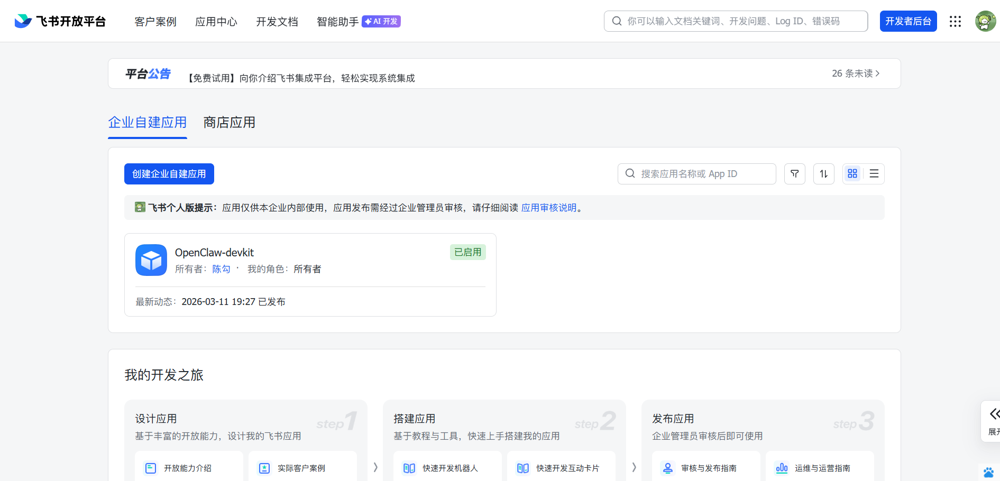
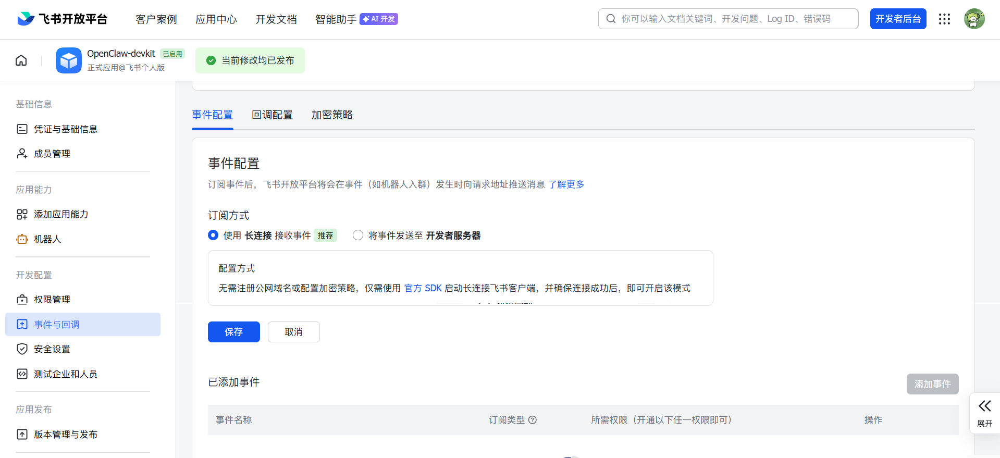
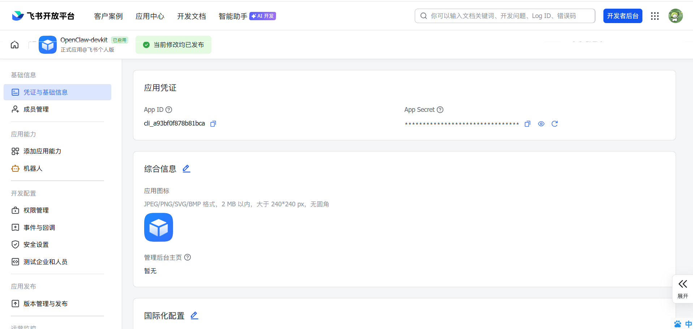

# 👶 零基础！飞书 (Feishu/Lark) 接入 OpenClaw 保姆级完整教程

> 🎯 **本教程专为 OpenClaw 用户设计。**
> 跟着下面的图文步骤，你可以在 10 分钟内完成飞书机器人接入（长连接模式），无需公网 IP。

---

## 🟢 核心理念：我们需要准备哪几把“钥匙”？
将 OpenClaw 接入飞书（Lark）长连接模式，通常需要以下凭证：
1. **App ID**：应用唯一标识（相当于机器人账号 ID）。
2. **App Secret**：应用密钥（相当于机器人密码）。
3. **Verification Token**：事件订阅校验凭证（用于校验回调来源）。
4. **Encrypt Key（可选）**：当你开启事件加密传输时必须填写。

> [!TIP]
> 飞书平台不同版本（飞书中国站 / Lark 国际站）界面文案可能略有差异，但菜单路径一致：
> **开发者后台 -> 你的应用 -> 凭证与基础信息 / 事件与回调**。

---

## 第 1 步：在飞书开放平台创建企业自建应用

1. 打开 [飞书开放平台](https://open.feishu.cn/)（Lark 国际站可使用 https://open.larksuite.com/）。
2. 登录管理员账号，进入 **开发者后台**。
3. 点击 **创建应用**，选择 **企业自建应用（Custom App）**。
4. 填写应用名称（建议：`OpenClaw-devkit`）和应用描述，确认创建。
5. 创建完成后进入应用详情页。



---

## 第 2 步：启用机器人能力并安装到企业

1. 在应用左侧菜单进入 **添加应用能力**。
2. 打开 **启用机器人** 开关。
3. 在 **可用范围** 中选择测试群或全员（建议先小范围测试）。
4. 进入 **版本管理与发布**，点击 **创建版本** 并 **发布**。
5. 在企业管理后台完成安装/可用配置（如需审批，按组织流程处理）。

---

## 第 3 步：配置事件订阅（长连接 / WebSocket）

1. 在应用菜单进入 **事件与回调 / Event Subscriptions**。
2. 打开 **事件订阅** 开关。
3. 选择 **长连接（WebSocket）** 模式。
4. 按下文“推荐事件列表”勾选必需事件。
5. 保存配置。
6. 找到 **Verification Token** 并复制。
7. 如果你启用了“加密传输”或“Encrypt”开关，再复制 **Encrypt Key**。
8. 如果未启用加密，`Encrypt Key` 可留空（或不填）。



### 常见报错排查：未检测到应用连接信息

如果在飞书后台保存长连接配置时看到提示：
"未检测到应用连接信息，请确保长连接建立成功后再保存配置"，按以下顺序处理：

1. 先填好 App ID / App Secret（如何获取详见第 4 步），再启动 OpenClaw 服务。
2. 在飞书后台确认当前应用已经发布并安装到企业（未发布的应用不会建立稳定连接）。
3. 检查事件订阅页是否已开启“长连接（WebSocket）”，并保持在该页面刷新状态。
4. 打开网关日志，确认是否出现 WebSocket connected、event stream started 等成功字样。
5. 若日志没有连接成功，优先排查出网网络：
    - 服务器是否可访问飞书开放平台域名
    - 是否配置了 HTTP_PROXY / HTTPS_PROXY
    - 代理是否允许容器网络出站
6. 再次返回事件订阅页面，点击刷新后重新保存。

若仍失败，通常是“应用凭证不匹配”或“应用未发布安装”导致。请重新核对：
- App ID / App Secret 是否来自同一个应用
- 当前租户是否就是该应用的安装租户
- 机器人能力是否已启用

---

## 第 4 步：获取 App ID 与 App Secret

1. 进入 **凭证与基础信息 / Credentials & Basic Info**。
2. 在页面中找到并复制 **App ID**。
3. 点击显示或重置密钥后复制 **App Secret**。
4. 将两项临时保存到你的密码管理器或安全笔记中。



---

## 第 5 步：填写 OpenClaw `.env` 示例

在 OpenClaw 根目录创建或编辑 `.env` 文件（首次可从 `.env.example` 复制）：

```env
# Feishu/Lark App identity
FEISHU_APP_ID=cli_xxxxxxxxxxxxxxxxx
FEISHU_APP_SECRET=xxxxxxxxxxxxxxxxxxxxxxxx

# Event verification (required when event subscription enabled)
FEISHU_VERIFICATION_TOKEN=xxxxxxxxxxxxxxxx

# Optional: only required when encrypted event payload is enabled
FEISHU_ENCRYPT_KEY=xxxxxxxxxxxxxxxx

# Recommended mode for intranet/no-public-ip deployment
FEISHU_EVENT_MODE=websocket
```

> [!IMPORTANT]
> 当前仓库的 `.env.example` 默认**不包含**上面这些 `FEISHU_*` 键名，且新版本 OpenClaw 在通过 `make onboard` 配置时**不一定会从 `.env` 中读取这些变量**。实际生效的配置以 `~/.openclaw/openclaw.json` 中的落盘键名和值为准。
> >
> > 上面的 `.env` 代码片段主要用于帮你**理解飞书控制台字段与 OpenClaw 内部配置项之间的映射关系**。如果你希望继续使用 `.env` 方式，请先完成 `make onboard`，然后对照 `~/.openclaw/openclaw.json` 中的字段名称，将对应值手动映射到你自己的环境变量命名方案中。

---

## 第 6 步：启动并验证接入是否成功

1. 保存 `.env` 后，在项目根目录执行：

```bash
docker compose down
docker compose up -d
```

2. 在飞书中把机器人拉入测试群。
3. 在群内 @ 机器人，发送 `Hi` 或 `帮我总结今天的待办`。
4. 若机器人正常响应，说明接入成功。

**推荐日志检查点**：
- 网关日志出现 WebSocket connected / event received。
- 事件处理无鉴权错误（invalid token / decrypt failed）。

---

## ✅ 推荐权限点与事件列表（可直接照抄）

### 建议开启的应用权限（Scopes）
- 获取与发送单聊/群聊消息
- 获取会话基本信息（群 ID、会话类型）
- 读取 @ 机器人的消息内容
- 发送富文本或卡片消息（如你启用了卡片交互）

### 建议订阅的事件（Events）
- 机器人被 @（消息触发核心）
- 群消息（仅建议在受控群范围内启用）
- 单聊消息（如需 DMs 能力）
- 机器人加入群聊 / 会话变更（可选，用于状态同步）

> [!TIP]
> 权限遵循最小化原则：先开启最小必需权限跑通流程，再按需扩展。

---

## 🚀 进阶建议（强烈推荐）

1. **先小范围灰度**：仅在一个测试群启用，验证稳定后再扩大范围。
2. **开启管理员审批**：若团队多人使用，建议配合 OpenClaw 的管理员审批能力，避免高危操作误触发。
3. **频道白名单**：只允许机器人在指定业务群工作，降低噪音与风险。
4. **代理配置**：若网络受限，请在 `.env` 中配置 `HTTP_PROXY` / `HTTPS_PROXY`。
5. **日志监控**：定期检查网关日志，关注连接状态和事件处理情况，及时调整权限或排查问题。