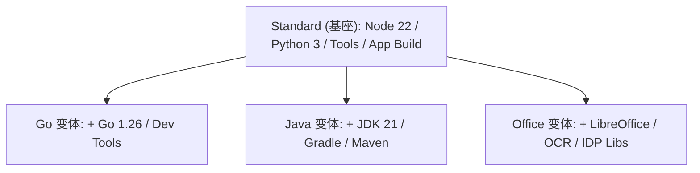

# OpenClaw DevKit 镜像变体对比指南 (2026 版)

> **核心变更**: 本项目现已全面采用 **1+3 DRY (Don't Repeat Yourself) 架构**。`Standard` 镜像作为唯一的基座（Parent），为其他所有变体提供核心运行时及工具。

---

## 🏗️ 1+3 DRY 继承架构

OpenClaw 镜像像积木一样构建，以最大化复用层级并减少冗余。



### 📉 架构收益：
*   **一致性**: 在基座增加一个工具，所有变体同步获得。
*   **极速构建**: 变体镜像仅包含差异层，构建时间缩短 80%。
*   **维护透明**: 修复基座漏洞即可覆盖全线产品。

---

## 📊 镜像命名矩阵

| 变体 (Variant) | 本地构建 (Local Tag) | Docker Registry (CI Tag) | 说明 |
| :--- | :--- | :--- | :--- |
| **Standard** | `openclaw-devkit:dev` | `ghcr.io/hrygo/openclaw-devkit:vX.Y.Z` | 默认标准版 |
| **Go** | `openclaw-devkit-go:dev` | `ghcr.io/hrygo/openclaw-devkit:vX.Y.Z-go` | 继承自 Standard |
| **Java** | `openclaw-devkit-java:dev` | `ghcr.io/hrygo/openclaw-devkit:vX.Y.Z-java` | 继承自 Go+Standard |
| **Office** | `openclaw-devkit-office:dev` | `ghcr.io/hrygo/openclaw-devkit:vX.Y.Z-office` | 继承自 Standard |

---

## 🛠️ 功能组件矩阵

### 1. 核心运行时 (全部继承自 Standard)
| 组件 | Standard | Go | Java | Office |
|---|:---:|:---:|:---:|:---:|
| Node.js 22 LTS | ✅ | ✅ | ✅ | ✅ |
| Python 3.13 | ✅ | ✅ | ✅ | ✅ |
| Bun (TypeScript) | ✅ | ✅ | ✅ | ✅ |
| **Go 1.26** | ❌ | ✅ | ✅ | ❌ |
| **JDK 21 (Temurin)** | ❌ | ❌ | ✅ | ❌ |

### 2. 2026 AI Agent 工具 (全部继承自 Standard)
| 工具 | 价值 | Standard | Go | Java | Office |
|---|---|:---:|:---:|:---:|:---:|
| **Claude Code** | Anthropic 官方编码 CLI | ✅ | ✅ | ✅ | ✅ |
| **OpenCode** | 开源 AI 辅助编码套件 | ✅ | ✅ | ✅ | ✅ |
| **uv** | Python 极速包管理 | ✅ | ✅ | ✅ | ✅ |
| **yq** | YAML/XML 智能解析 | ✅ | ✅ | ✅ | ✅ |
| **tldr** | 命令速查 (防幻觉) | ✅ | ✅ | ✅ | ✅ |
| **fzf / zoxide** | 智能跳转与搜索 | ✅ | ✅ | ✅ | ✅ |
| **Playwright** | 网页自动化专家 | ✅ | ✅ | ✅ | ✅ |

### 3. 2026 旗舰文档解析 (Office 独有)
| 组件 | 描述 | Standard | Go | Java | Office |
|---|---|:---:|:---:|:---:|:---:|
| **IBM Docling** | 语义级 PDF 转 Markdown | ❌ | ❌ | ❌ | ✅ |
| **Marker-PDF** | 高保真文档解析 | ❌ | ❌ | ❌ | ✅ |
| **OCRmyPDF** | 扫描件 PDF/A 搜索化 | ❌ | ❌ | ❌ | ✅ |
| **Polars** | 高性能 Rust 数据处理引擎 | ❌ | ❌ | ❌ | ✅ |
| **LibreOffice** | 无头版高保真排版 | ❌ | ❌ | ❌ | ✅ |

---

## 🎯 变体定位与选型

### Standard — 万能基座 (默认推荐)
面向 **前端/Node.js/Python 开发者**。包含最完整的 Agent 工具链。
*   **适用场景**: AI Agent 驱动的纯 TS/JS/Python 项目、Web 自动化。

### Go — 后端全栈版
在 Standard 基础上叠加 **Go 1.26 完整工具链** (`gopls`, `dlv`, `golangci-lint`)。
*   **适用场景**: 高性能后端开发、CLI 工具开发、微服务架构。

### Java — 企业全栈版
功能最强的镜像。在包含 Go 的基础上，增加 **JDK 21 + Gradle + Maven**。
*   **适用场景**: 银行/保险等企业级 Spring Boot 项目开发、多语言混合系统。

### Office — 2026 IDP 旗舰
专注于 **知识库 (RAG) 预处理**。包含 Tesseract OCR（简繁）、Pandoc、LaTeX。
*   **适用场景**: 扫描件数字化、高保真报表生成、大规模 PDF 解析、数据分析。

---

## 🔄 常用操作

```bash
# 安装指定版本
make install <variant>   # variant: dev(默认), go, java, office

# 智能构建 (本地)
make build               # 构建基座
make build-go            # 自动构建基座并安装 Go 插件

# 强制重建并重启
make rebuild office      # 立刻重构 Office 层
```

> 💡 **提示**: 切换版本时，容器卷（Workspace）会被保留，仅底层工具链发生变更。
