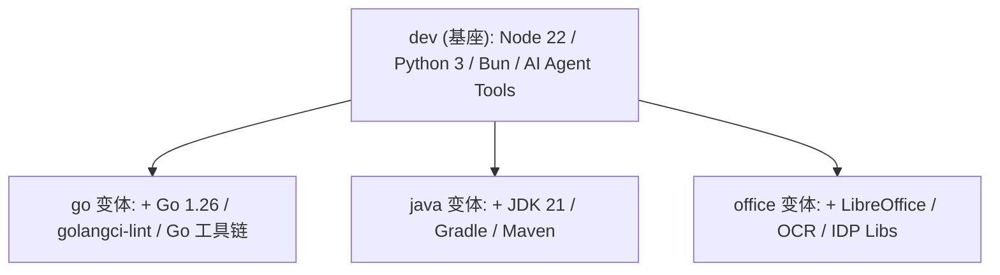

# OpenClaw DevKit 镜像变体对比指南

> **核心变更**: 本项目采用 **1+4 DRY (Don't Repeat Yourself) 架构**。`dev` 镜像作为唯一的基座（Parent），为其他所有变体提供核心运行时及工具。

---

## 🏗️ 4 版本继承架构



### 📉 架构收益
- **一致性**: 在基座增加一个工具，所有变体同步获得
- **极速构建**: 变体镜像仅包含差异层，构建时间缩短 80%
- **维护透明**: 修复基座漏洞即可覆盖全线产品

---

## 📊 镜像命名矩阵

| 变体 | Dockerfile | 本地构建 | Docker Registry | 说明 |
| :--- | :--- | :--- | :--- | :--- |
| **dev** | `Dockerfile` | `openclaw-devkit:dev` | `ghcr.io/hrygo/openclaw-devkit:vX.Y.Z` | 默认标准版 |
| **go** | `Dockerfile.go` | `openclaw-devkit-go:dev` | `ghcr.io/hrygo/openclaw-devkit:vX.Y.Z-go` | Go 开发版 |
| **java** | `Dockerfile.java` | `openclaw-devkit-java:dev` | `ghcr.io/hrygo/openclaw-devkit:vX.Y.Z-java` | Java 开发版 |
| **office** | `Dockerfile.office` | `openclaw-devkit-office:dev` | `ghcr.io/hrygo/openclaw-devkit:vX.Y.Z-office` | 办公/IDP 版 |

---

## 🛠️ 工具版本差异详解

### 1. 核心运行时对比

| 组件 | dev | go | java | office |
| :--- | :---: | :---: | :---: | :---: |
| **Node.js** 22 LTS | ✅ | ✅ | ✅ | ✅ |
| **Python** 3.x | ✅ | ✅ | ✅ | ✅ |
| **Bun** 1.3.10 | ✅ | ✅ | ✅ | ✅ |
| **Go** 1.26.1 | ✅ | ✅+ | ✅ | ✅ |
| **JDK** 21 (Temurin) | ❌ | ❌ | ✅ | ❌ |
| **Gradle** 8.14 | ❌ | ❌ | ✅ | ❌ |
| **Maven** 3.9.9 | ❌ | ❌ | ✅ | ❌ |

> `Go 1.26.1`: dev 版内置，go 版显式重新安装（确保版本一致性）

### 2. AI Agent 工具 (全版本通用)

| 工具 | 版本 | 说明 |
| :--- | :--- | :--- |
| **Claude Code** | latest | Anthropic 官方编码 CLI |
| **OpenCode** | latest | 开源 AI 辅助编码套件 |
| **Pi-Mono** | latest | Mario Zechner AI 编码 Agent |
| **uv** | latest | Python 极速包管理 (Astral) |
| **yq** | latest | YAML/XML 智能解析 |
| **just** | latest | 命令行任务运行器 |
| **lazygit** | latest | Git TUI 交互工具 |
| **tldr** | latest | 命令速查 (防幻觉) |
| **fzf** / **zoxide** | latest | 智能跳转与搜索 |
| **Playwright** | latest | 网页自动化 + Chromium 浏览器 |
| **GitHub CLI (gh)** | latest | GitHub 官方 CLI |

### 3. Go 开发工具链 (go 版独有)

| 工具 | 版本 | 说明 |
| :--- | :--- | :--- |
| **golangci-lint** | 1.64.8 | Go 代码静态分析 (多 linter 聚合) |
| **gopls** | latest | Go 语言服务器 (LSP) |
| **dlv** | latest | Go 调试器 (Delve) |
| **staticcheck** | latest | Go 静态检查 |
| **gosec** | latest | Go 安全扫描 |
| **goimports** | latest | Go 导入自动管理 |
| **air** | latest | Go 热重载 (开发时使用) |
| **mockgen** | latest | Go Mock 代码生成 |
| **wire** | latest | Google Wire 依赖注入 |
| **ginkgo** | latest | Go BDD 测试框架

### 4. 办公自动化与 IDP 工具 (Office 独有)

| 组件              | 说明                          | 版本  |
| ----------------- | ---------------------------- | ----- |
| **LibreOffice**   | 无头版办公套件 (Writer/Calc) | latest (nogui) |
| **OCRmyPDF**     | 扫描件 PDF/A 搜索化          | latest |
| **Tesseract OCR** | OCR 引擎 (简/繁/英)          | latest |
| **poppler-utils** | PDF 工具集                    | latest |
| **Ghostscript**   | PostScript/PDF 处理          | latest |
| **ImageMagick**   | 图像处理                     | latest |

### 5. Python 库差异

| 包分类 | dev | go | java | office |
| :--- | :---: | :---: | :---: | :---: |
| **文档处理** | | | | |
| `python-docx` | ✅ | ✅ | ✅ | ✅ |
| `python-pptx` | ✅ | ✅ | ✅ | ✅ |
| `openpyxl` | ✅ | ✅ | ✅ | ✅ |
| `pypdf` | ❌ | ❌ | ❌ | ✅ |
| `pymupdf` | ❌ | ❌ | ❌ | ✅ |
| `reportlab` | ❌ | ❌ | ❌ | ✅ |
| `docx2txt` | ❌ | ❌ | ❌ | ✅ |
| **数据处理** | | | | |
| `pandas` | ❌ | ❌ | ❌ | ✅ |
| `numpy` | ❌ | ❌ | ❌ | ✅ |
| `polars` | ❌ | ❌ | ❌ | ✅ |
| `pyarrow` | ❌ | ❌ | ❌ | ✅ |
| **网络/自动化** | | | | |
| `requests` | ❌ | ❌ | ❌ | ✅ |
| `aiohttp` | ❌ | ❌ | ❌ | ✅ |
| `selenium` | ❌ | ❌ | ❌ | ✅ |
| `webdriver-manager` | ❌ | ❌ | ❌ | ✅ |
| **OCR/图像** | | | | |
| `pytesseract` | ❌ | ❌ | ❌ | ✅ |
| `pdf2image` | ❌ | ❌ | ❌ | ✅ |
| `pillow` | ❌ | ❌ | ❌ | ✅ |
| `xlwings` | ❌ | ❌ | ❌ | ✅ |
| **其他** | | | | |
| `beautifulsoup4` | ✅ | ✅ | ✅ | ✅ |
| `lxml` | ✅ | ✅ | ✅ | ✅ |
| `pyyaml` | ✅ | ✅ | ✅ | ✅ |
| `pandoc` | ✅ | ✅ | ✅ | ✅ |

### 6. 旗舰级 IDP 工具 (office 版独有)

| 工具 | 说明 |
| :--- | :--- |
| **Docling** | IBM 语义级 PDF→Markdown 转换 |
| **Marker-PDF** | 高保真文档解析 (保留表格/布局) |
| **pdfplumber** | PDF 内容精确提取 |
| **unstructured** | 多格式文档解析 (PDF/Word/HTML/CSV 等) |

---

## 🎯 变体定位与推荐场景

### dev — 万能基座 (默认推荐)

**定位**: 通用型开发环境，适合大多数场景

**包含**: Node 22 + Python 3 + Bun + AI Agent 工具链 + Playwright

**推荐场景**:
- 前端/全栈开发 (React, Vue, Next.js 等)
- Node.js / TypeScript 项目
- Python 脚本与数据处理
- Web 自动化测试
- AI Agent 工作流编排
- API 开发与调试

---

### go — Go 开发专精版

**定位**: Go 语言深度开发环境，在 dev 基础上增强

**额外包含**: Go 1.26.1 + golangci-lint + 完整 Go 工具链

**推荐场景**:
- Go 后端服务开发
- 微服务架构开发
- 云原生应用 (Kubernetes, Docker 等)
- CLI 工具开发
- 需要代码质量检查 (lint/静态分析)
- 大型 Go 项目团队协作

---

### java — 企业全栈版

**定位**: Java 生态系统开发环境

**额外包含**: JDK 21 + Gradle 8.14 + Maven 3.9.9

**推荐场景**:
- Spring Boot 企业应用开发
- 银行/保险系统开发
- Android 应用开发 (Gradle 构建)
- Maven/Gradle 依赖管理
- Java 微服务
- 多语言混合系统 (Java + Node.js)

---

### office — IDP 旗舰版

**定位**: 智能文档处理与知识库构建

**额外包含**: LibreOffice + OCR + Docling + Marker-PDF + 完整 Python 数据栈

**推荐场景**:
- RAG 知识库构建 (PDF 解析)
- 扫描件数字化 (OCR)
- 文档自动化处理
- 数据分析 (pandas/polars)
- 报表生成 (Excel/Word/PDF)
- 智能文档理解 (Docling, Marker)
- 批量文档转换

---

## 📋 快速选择指南

| 需求 | 推荐版本 |
| :--- | :--- |
| 不确定，用默认 | **dev** |
| Go 后端开发 | **go** |
| Spring Boot 开发 | **java** |
| 文档处理/RAG | **office** |
| 前后端全栈 | **dev** |
| Go + 其他语言 | **go** |
| Java + 前端 | **java** |
| PDF 自动化 | **office** |

---

## 🔄 常用操作

```bash
# 首次安装（仅需一次）
make install <variant>   # variant: dev(默认), go, java, office

# 后续切换镜像（无需重复 install）
# 1. 修改 .env 中的 OPENCLAW_IMAGE
# 2. 拉取/构建并重启
make rebuild go        # 或: make build go && make restart
make rebuild java      # 或: make build java && make restart
make rebuild office    # 或: make build office && make restart
```

### 首次安装 vs 后续切换

| 操作 | 命令 | 适用场景 |
| :--- | :--- | :--- |
| **首次安装** | `make install <variant>` | 首次部署环境，创建数据目录和配置 |
| **切换镜像** | `make rebuild <variant>` | 已安装后需要切换到不同版本 |

> [!NOTE]
> `make install` 仅用于**首次安装**。后续切换镜像只需修改 `.env` 并使用 `make build/rebuild` 即可，数据目录会被保留。

> 💡 **提示**: 切换版本时，容器卷（Workspace）会被保留，仅底层工具链发生变更。
